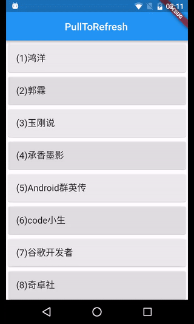

# FlutterPullToRefreshView

Flutter版的下拉刷新控件，且支持上滑至底部自动加载更多


## Screenshot




## Add package dependency

在pubspec.yaml文件中添加依赖

```flutter_pull_to_refresh: ^1.0.0```  

然后执行获取依赖包的命令

```flutter packages get```


## Import

在需要使用时，导入依赖

```
import 'package:flutter_pull_to_refresh/pull_to_refresh.dart'
```


## Usage

控件基本用法的关键代码如下：

```
  @override
  Widget build(BuildContext context) {
    print('_PullToRefreshDemoState.build');
    return PullToRefreshView(
        key: _keyPullToRefresh,
        child: _buildWidget(),
        onRefresh: _onRefresh,
        onLoadMore: _onLoadMore,
    );
  }

  Widget _buildWidget() {
    return LoadMoreListView<String>(_list,
        (index, itemData) {
          //print("item = $index");
          return new Card(
            color: colors[index % colors.length],
            child: ListTile(title: Text(itemData, style: _bigFont))
          );
        },
        key: _keyLoadMore,
        // 自定义加载更多item的样式
        //loadMoreItem: Center(child: Text('Loading...')),
    );
  }
```

详细使用示例请阅读main.dart  


## Exist Problem

1、下拉刷新动效暂不支持修改，也不支持使用自定义的动效  


## About me

微博：[@萧雾宇](http://weibo.com/payge)  


## License

MIT License，详细内容请查看LICENSE文件


